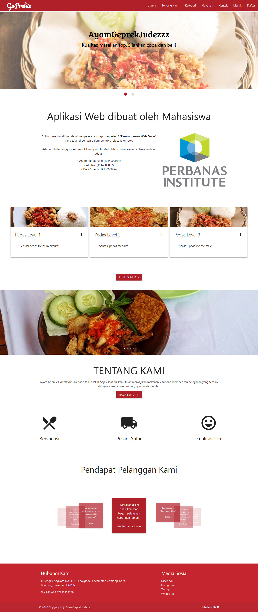
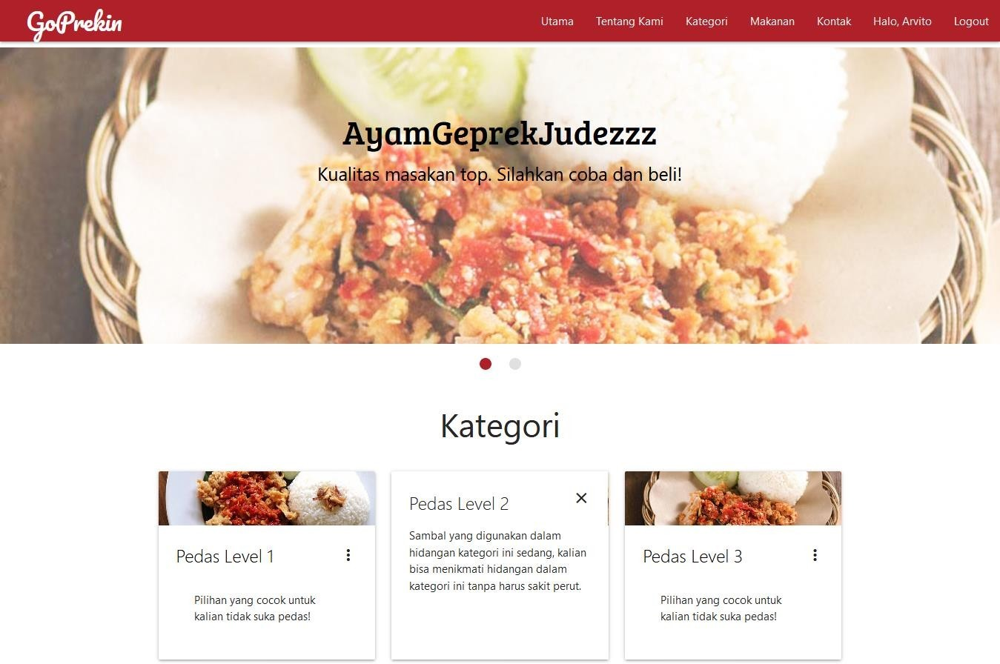

# GoPrekin
A restaurant order registration system website that was made for college assignment. 
Website is based on [RestroGirls](https://github.com/samprits5/RestroGirls) as template.
[Full documentation](https://github.com/ArigathanksGozaimuch/GoPrekin/blob/master/Documentation.pdf) (in Bahasa) can be seen in a PDF Document File.
# Server Requirements
* Apache
* PHP Version 7.1.33 or Newer
* MySQL (with "goprekin" database present)
# Preview
* Home Page

* About Page

* Category Page

* Food List

* Order ID Generation

